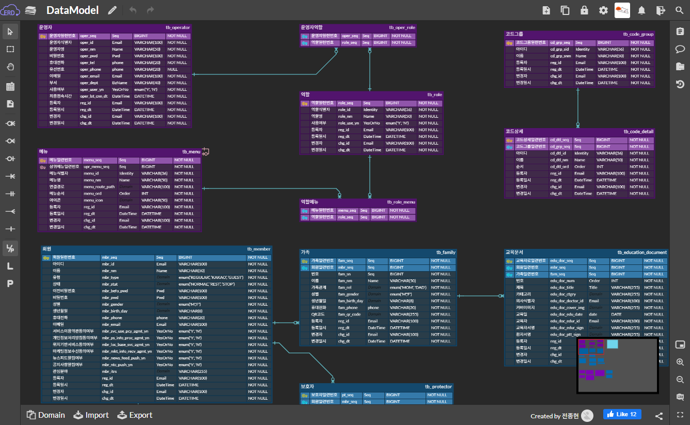

# ERDCloud Ads Blocker

A Chrome extension that removes on ERDCloud.



## Installation

### Method 1: Chrome Extension

1. Open `chrome://extensions` in Chrome
2. Enable Developer mode
3. Click "Load unpacked"
4. Select this folder

### Method 2: Console Script (Quick & Easy)

If you are sick of installing more extensions, simply copy the code bellow and paste it into the browser's Developer Tools console (F12) on ERDCloud.

```javascript
    (()=>{"use strict";let e=".erd-ads-area{display:none!important}.ads-block-warning-overlay{display:none!important}.wrapContentERD .erdWrap{width:100%!important}",t="__erdcloud_layout_canvas_fix_style__";function n(){if(document.getElementById(t))return;let n=document.createElement("style");n.id=t,n.type="text/css",n.textContent=e,document.head.appendChild(n)}function i(){let e=window.devicePixelRatio||1;document.querySelectorAll("canvas").forEach(t=>{let n=t.getBoundingClientRect();if(!n.width||!n.height)return;let i=Math.round(n.width*e),a=Math.round(n.height*e);if(t.width!==i||t.height!==a){t.width=i,t.height=a;let r=t.getContext("2d");r&&r.setTransform(e,0,0,e,0,0)}})}function a(){window.dispatchEvent(new Event("resize"))}function r(){n(),requestAnimationFrame(()=>{i(),a()})}function d(e,t){let n=null;return()=>{n&&clearTimeout(n),n=setTimeout(()=>e(),t)}}r(),window.addEventListener("resize",d(()=>{i()},200),{passive:!0});let l=new MutationObserver(e=>{let t=!1;for(let i of e)"childList"===i.type&&i.addedNodes.forEach(e=>{if(1===e.nodeType){let n=e;(n.classList?.contains("erd-ads-area")||n.classList?.contains("ads-block-warning-overlay")||n.querySelector?.(".erd-ads-area, .ads-block-warning-overlay"))&&(t=!0)}});t&&n()});l.observe(document.body,{childList:!0,subtree:!0})})();
```